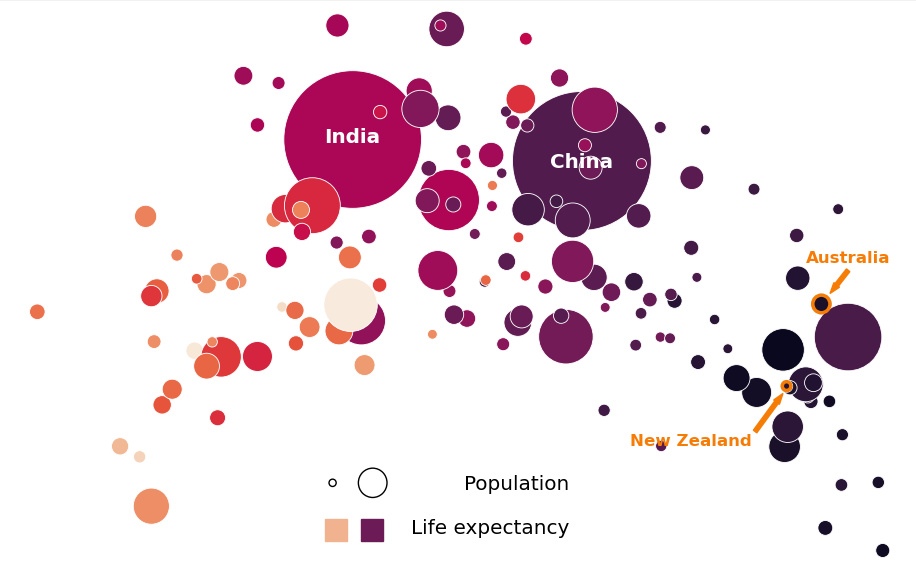

## Portfolio

---

### Exploratory Data Analysis & Dashboard

[Exploratory Data Analysis on Development Indicators and CO2 Emission](https://github.com/dottieshuangzhang/world-bank_data-analysis)
- Python
- API
- Data wrangling
- Data visualisation
- Statistics
- Hypothesis test  
This is a mini project I did for my IOD Data Science and AI certificate using Python and Jupyter Notebook. In this project, we collect data from the World Bank V2 Indicators API, for more than 150 countries across 40 years. We performed cross-sectional and time-series analyses to examine how CO2 emission is affected by various development indicators. 

---

### Machine Learning

[Fraudulent Risk Prediction: Machine Learning Assisting Audit Planning](https://github.com/dottieshuangzhang/audit-risk_prediction)
- Python
- Machine learning
- Fraud prediction
- Regression
- Classification
This is a mini project I did for my IOD Data Science and AI certificate using Python and Jupyter Notebook. In this analysis, our data comes from Comptroller and Auditor General (CAG) of India and the dataset is consisted of present and historical risk factors of 777 companies from 14 different sectors. We examined the relationship between risk factors and fraud risk score obtained from analytical procedure (Regression) and tested the performance of 5 machine learning models in the prediction of fraud risk class (Classification).

[Company Bankruptcy Prediction](https://github.com/dottieshuangzhang/company-bankruptcy_prediction)
- Python
- Exploratory data analysis
- Machine learning
- Deep learning
- Company bankruptcy
This is the two-week capstone project I did for my IOD Data Science and AI certificate using Python and Jupyter Notebook. Our data were collected from the Taiwan Economic Journal for the years 1999–2009 and company bankruptcy was defined based on the business regulations of the Taiwan Stock Exchange. The aim to this project is to build an effective and efficient machine learning model for bankruptcy prediction, and identify the key parameters and features that significantly influence the model performance.

---

### Natural Language Processing

[Sentiment Analysis in Financial News](https://github.com/dottieshuangzhang/financial-news_sentiment-analysis)
- Python
- Machine learning
- Natural language processing
- Sentiment analysis
- Financial phrasebank
This is a mini project I did for my IOD Data Science and AI certificate using Python and Jupyter Notebook. In this analysis, we test the performance of several machine learning algorithms and feature attraction approaches on a financial_phrasebank dataset, which covers a collection of 4840 sentences from financial news and is annotated by 16 financial professionals. 

---

Page template forked from <a href="https://github.com/evanca/quick-portfolio">evanca</a>

<!-- Remove above link if you don't want to attibute -->
